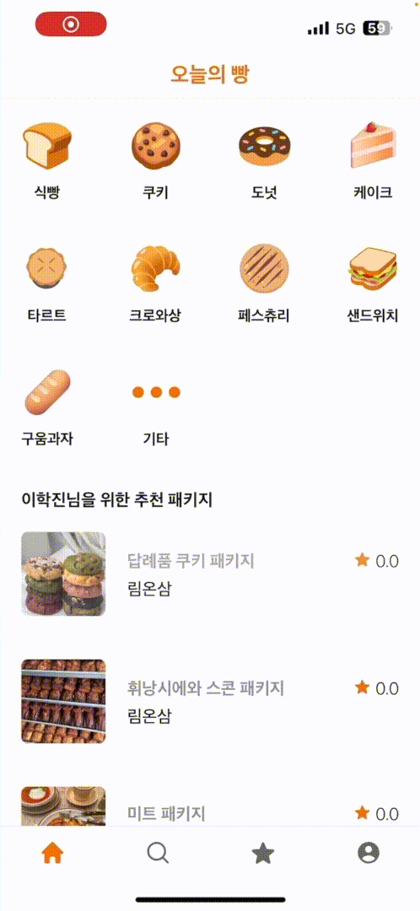

	<h1>Today Bread Server</h1>
	

		<b>Naver Cloud Platform Appetizer Development Supporters Team 5</b>
	

	 

## 1. 서비스 소개

### 1-1. 오늘의 빵이란?

'오늘의 빵'은 전국에 있는 베이커리의 맛있는 빵 패키지를 **구독**하여, 주기적으로 신선한 빵을 배송 받을 수 있는 **빵 구독 플랫폼**입니다.

### 1-2. 주요 기능

- **베이커리 등록 및 조회**
  - 베이커리 사장님은 자신의 베이커리를 '오늘의 빵'에 등록할 수 있습니다.
  - 소비자는 등록되어 있는 베이커리를 조회할 수 있습니다.

- **빵 패키지 등록 및 조회**
  - 베이커리 사장님은 자신의 베이커리에 빵 패키지를 구독 상품으로 등록하여 판매할 수 있습니다.
  - 소비자는 판매중인 빵 패키지를 조회할 수 있습니다.

- **빵 패키지 랭킹 및 추천**
  - 판매중인 빵 패키지의 판매 혹은 별점 순으로 랭킹을 조회할 수 있습니다.

- **빵 패키지 구독 결제**
  - 스텝페이의 구독 API를 사용하여, 빵 패키지를 매달 구독하여 결제할 수 있습니다.

 

## 2. 서비스 구조

### 2-1. 사용 기술

### 2-2. 배포 구조

### 2-3. GraphQL Schema

[GraphQL Schema Link](https://github.com/daily-develop/today-bread-server/tree/main/src/main/resources/graphql)

### 2-4. Database Schema

 

## 3. 구현 모습

### 3-1. 인증 화면

### 3-2. 홈 화면

### 3-3. 검색

### 3-4. 결제(구독)

### 3-5. 프로필

### 3-6. 리뷰

### 3-7. 패키지 랭킹

### 3-8. 베이커리 생성

### 3-9. 패키지 생성

### 3-10. 베이커리 주문 조회

### 3-11. 판매 종료

### 3-12. 배포

 

## 4. 팀원

<table align="center">
  <tr align="center">
    <td>
        
    </td>
    <td>
        
    </td>
  </tr>    
  <tr align="center">
    <td>
      <a href="https://github.com/himitery">
        단국대학교 소프트웨어학과 이학진
      </a>
    </td>
    <td>
      <a href="https://github.com/govl6113">
        단국대학교 응용컴퓨터공학과 배지현
      </a>
    </td>
  </tr>
  <tr align="center">
    <td>
      Server & Application
    </td>
    <td>
      Server
    </td>
  </tr>
</table>
